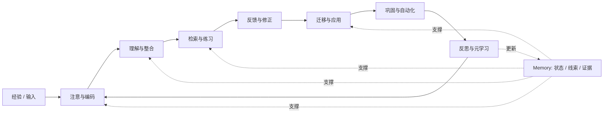

# 什么是学习：从人类学习到 Agent 记忆系统

Date: 2026-05-27
Status: expanded research note

## 结论

学习不是“把信息存进记忆”。学习是一套让经验改变未来行为的闭环：经验被注意、编码、理解、练习、反馈、迁移、巩固和反思，最后形成更稳定的知识、技能、判断标准和自我调节能力。

对 Skill 和 Agent 来说，Memory 和 Learning 高度重叠，但不是同一个概念。Memory 是状态层和证据层；Learning 是利用这些状态来改变后续行为的机制层。一个只有存储、没有检索、反馈、评估、提升和遗忘的系统，只是资料库，不是学习系统。

## 一张总图



这不是某一个单一理论的照搬，而是把学习科学、技能习得、自我调节学习、检索练习、迁移研究和评估框架合成后的工作模型。

## 来源基础

| 来源 | 核心观点 | 本文吸收方式 |
| --- | --- | --- |
| [How People Learn II](https://www.nationalacademies.org/read/24783/chapter/2) | 学习由记忆、注意、自我调节、动机、文化和环境共同塑造；Memory 是学习的重要基础，但不是单一能力 | 把学习定义为多过程协调，而不是单纯存储 |
| [Kolb experiential learning](https://citt.it.ufl.edu/resources/course-development/the-learning-process/types-of-learners/kolbs-four-stages-of-learning/) | 学习通过 experience、reflection、conceptualization、experimentation 循环发生 | 把学习看成经验到行动的循环 |
| [Fitts and Posner skill acquisition](https://pmc.ncbi.nlm.nih.gov/articles/PMC4330992/) | 技能从 cognitive 到 associative 再到 autonomous | 把 Skill 看成程序性学习的稳定产物 |
| [Roediger and Karpicke, testing effect](https://journals.sagepub.com/doi/10.1111/j.1467-9280.2006.01693.x) | 检索测试不只是评估，也能增强长期保持 | 把 eval 和 practice 视为同一闭环的一部分 |
| [Dunlosky et al., learning techniques](https://www.psychologicalscience.org/publications/journals/pspi/learning-techniques.html) | Practice testing 和 distributed practice 具有高效用 | 评估学习时强调延迟检索和间隔练习 |
| [Learning and Transfer](https://www.nationalacademies.org/read/9853/chapter/6) | 迁移需要足够初始学习、抽象表示、动态策略选择和反馈 | 把“能迁移”作为高阶学习成果 |
| [Self-regulated learning](https://teaching.fsu.edu/wp-content/uploads/2018/03/1579228674_1stChap.pdf) | 深层、持久、独立的学习需要目标设定、计划、监控、评估和调节 | 把反思、校准和求助条件纳入学习产物 |
| [Bloom's Taxonomy](https://www.uvm.edu/ctl/blooms-taxonomy) | 评估可从 remember 到 create 分层 | 把学习评估拆成认知层级 |
| [Kirkpatrick Model](https://www.kirkpatrickpartners.com/the-kirkpatrick-model/) | 学习评估要看 reaction、learning、behavior、results | 把“行为改变”和“外部结果”纳入成果评估 |

## 人类学习会经历哪些阶段

| 阶段 | 人类发生什么 | 关键产物 | 常见失败 |
| --- | --- | --- | --- |
| 1. 目标与动机 | 知道为什么学、要解决什么问题、成功标准是什么 | 目标、期待、动机、注意方向 | 没目标，只被动接收 |
| 2. 经验输入 | 接触任务、例子、讲解、失败、观察或实践 | 原始经历、场景、材料 | 输入太碎或缺上下文 |
| 3. 注意与编码 | 选择重要线索，把信息进入可处理状态 | cue、关键词、初步表征 | 注意错对象，遗漏关键约束 |
| 4. 理解与整合 | 把新信息连到旧知识，形成 schema 和解释 | 概念模型、因果关系、边界 | 只记术语，不理解关系 |
| 5. 检索与练习 | 主动回忆、做题、模拟、重复执行 | 练习记录、错误模式、可调用路径 | 只重读，不主动检索 |
| 6. 反馈与修正 | 对比目标和结果，定位错误，调整策略 | 反馈、归因、修正计划 | 只知道错了，不知道为什么 |
| 7. 迁移与应用 | 在新任务、新情境中使用已有知识 | 适用范围、反例、迁移策略 | 只在原场景会用 |
| 8. 巩固与自动化 | 能低成本、稳定、快速地执行 | procedure、habit、Skill | 自动化了错误动作 |
| 9. 反思与元学习 | 判断自己学得怎样、怎么学更有效、何时求助 | rubric、学习策略、升级条件 | 盲目自信或过度怀疑 |

这个模型是循环的，不是一次性流水线。人类经常在反馈后回到理解阶段，在迁移失败后回到练习阶段，在反思后重设目标。

## 三个经典视角如何合并

| 视角 | 关注点 | 对阶段模型的补充 |
| --- | --- | --- |
| 经验学习 | 经验、反思、抽象、实验 | 强调学习必须回到行动 |
| 技能习得 | 从显性控制到自动化 | 解释 Skill 如何形成 |
| 自我调节 | 计划、监控、反思 | 解释学习者如何管理自己的学习 |

对 Agent 设计最有用的地方是：学习不是“读了资料就完成”，而是必须经过可观察的行动、反馈和再尝试。没有行动，无法证明理解；没有反馈，无法稳定修正；没有迁移，无法证明学到的是可泛化能力。

## 学习之后的产出是什么

| 产出 | 人类形式 | Agent / Skill 映射 | 评估问题 |
| --- | --- | --- | --- |
| 陈述性知识 | 事实、术语、规则 | semantic memory、knowledge note | 能否准确回忆和解释 |
| 情景记忆 | 某次经历、案例、失败 | run trace、case study、decision log | 能否在相似场景被检索 |
| 程序性技能 | 会做某类动作 | Skill、playbook、tool policy | 能否稳定执行 |
| 心智模型 | 因果关系、系统结构 | architecture note、concept map | 能否解释和预测 |
| 判断标准 | 什么算好、危险、完成 | rubric、acceptance criteria | 能否一致打分 |
| 策略库 | 遇到问题时怎么选路径 | troubleshooting tree、policy gate | 能否减少无效尝试 |
| 迁移能力 | 新场景中使用旧经验 | eval case family、transfer test | 能否跨场景成功 |
| 元认知 | 知道自己何时不确定 | self-review gate、escalation rule | 能否正确暂停或求助 |
| 身份与动机 | 觉得自己能学、愿意继续 | long-term preference、goal profile | 是否影响持续投入 |

这里最重要的区分是：不是所有学习产物都应该变成 Skill。Skill 更像已经压缩、验证、程序化后的程序性记忆。许多经验在证据不足时应该留在 episodic memory 或 case study 中，而不是直接提升为通用规则。

## Memory 和 Learning 的关系

| 问题 | Memory 视角 | Learning 视角 |
| --- | --- | --- |
| 保存什么 | 事实、经历、线索、状态、反馈 | 哪些经验会改变未来行为 |
| 什么时候用 | 检索相关上下文 | 选择策略、修正模型、迁移应用 |
| 怎么变好 | 更准、更全、更新鲜、更可检索 | 更少错误、更好迁移、更低返工 |
| 主要风险 | 污染、过期、不可检索、过度保存 | 过度泛化、错误提升、只记不改 |
| 成熟产物 | 稳定记忆项、案例库、知识图谱 | Skill、rubric、eval、policy、习惯 |

所以可以说：学习系统必须包含记忆系统，但记忆系统只有在接入检索、反馈、评估、提升和遗忘之后，才成为学习系统。

## 怎么评估学习成果

| 层 | 测什么 | 好证据 | 对 Agent 的对应 |
| --- | --- | --- | --- |
| 反应 | 学习材料是否相关、可用、愿意继续 | 相关性反馈、投入度 | 用户是否愿意继续用 |
| 记住 | 能否延迟回忆 | 延迟测试、主动检索 | 能否正确取回 memory |
| 理解 | 能否解释、举例、找反例 | 复述、概念图、反例 | 能否说明为什么这么做 |
| 应用 | 熟悉任务能否完成 | 标准任务通过率 | 固定 eval case 通过 |
| 迁移 | 新场景能否使用 | near / far transfer case | 变体任务通过 |
| 行为 | 后续行为是否改变 | 真实任务 trace、错误下降 | 工具选择、升级、恢复更好 |
| 结果 | 是否产生外部价值 | 验收通过、返工下降、指标改善 | 业务结果和用户验收 |
| 元学习 | 是否更会学习 | 更准自评、更好练习选择 | 更少无效记忆和错误提升 |

两个判断尤其关键：

1. 即时表现不等于长期学习。短时间重复阅读可能让人感觉熟悉，但延迟检索更能说明是否保留。
2. 记住不等于会迁移。一个人能在原题上表现好，不代表能在新场景中识别同一个底层结构。

## 学习评估的最小 Rubric

| 维度 | 通过信号 | 不通过信号 |
| --- | --- | --- |
| Retention | 延迟后仍能回忆关键内容 | 当场会，过后忘 |
| Explanation | 能用自己的话解释关系 | 只复述原文 |
| Error correction | 能定位错误原因并修正 | 只重复尝试 |
| Transfer | 能处理变体场景 | 一换题就失败 |
| Calibration | 知道自己哪里不确定 | 盲目自信 |
| Efficiency | 成本、时间、错误率下降 | 学了但更慢更乱 |
| Safety | 不把经验错用到高风险场景 | 过度泛化 |

这个 rubric 对人类和 Agent 都适用。差别在于，人类的证据可能来自考试、作品、行为观察；Agent 的证据应来自输出、trace、memory diff、eval case、人工反馈和长期趋势。

## 映射到 Agent 学习系统

一个 Agent 学习系统至少需要 6 层。

| 层 | 记什么 | 学什么 | 主要风险 |
| --- | --- | --- | --- |
| Trace memory | 工具调用、错误、执行路径 | 哪些路径有效 | trace 缺失导致无法归因 |
| Episodic memory | 任务案例、上下文、决策 | 哪些场景会复现 | 单例经验被过度泛化 |
| Semantic memory | 稳定事实、原则、边界 | 什么可以复用 | 事实过期 |
| Procedural memory | Skill、模板、流程 | 怎么稳定执行 | 错流程被自动化 |
| Eval memory | cases、rubrics、baselines | 是否真的变强 | 只看单次输出 |
| Evolution layer | promote、archive、supersede | 哪些经验进入长期系统 | 噪声进入共享规则 |

最小闭环可以这样表达：

```text
run
  -> trace
  -> outcome + feedback
  -> failure / improvement attribution
  -> memory update
  -> eval case or rubric update
  -> promote / archive / supersede
  -> only then consider Skill or rule changes
```

## 什么时候 Memory 变成 Learning

| 条件 | 没有它会怎样 |
| --- | --- |
| 可检索 | 记了但未来用不到 |
| 有上下文 | 用错场景 |
| 有反馈 | 无法知道记忆是否可靠 |
| 有归因 | 只保存结果，不知道原因 |
| 有评估 | 无法证明能力变强 |
| 有生命周期 | 旧记忆污染新任务 |
| 有提升边界 | 项目经验错误进入通用 Skill |

因此，一个 Agent 的 memory item 最好不是自由散文，而是带结构的学习证据。最低限度应包含：来源、上下文、触发条件、内容、可信度、适用范围、反例、最后验证时间、下一次怎么用。

## 对 Skill 设计的含义

| 设计问题 | 建议 |
| --- | --- |
| 经验何时变 Skill | 重复出现、有稳定修正路径、有评估证据 |
| Skill 应保存什么 | procedure、判断条件、边界、失败恢复、验证方法 |
| Skill 不该保存什么 | 单次偏好、私有上下文、未经验证的灵感 |
| Skill 如何评估 | 固定任务、变体任务、trace 检查、人工验收 |
| Skill 如何演化 | 先进入项目层，证据足够后再提升 |
| Skill 如何遗忘 | 标记过期、被替代、仅限历史参考 |

最关键的一点：Skill 不是“更长的提示词”。Skill 是被压缩后的学习产物，应该带有触发条件、操作步骤、质量门和边界。

## 对 Agent 评估的含义

Agent 是否“学会了”，不能只看这次答案是否漂亮。更可靠的评估要同时看：

| 证据 | 看什么 |
| --- | --- |
| Output | 最终结果是否满足目标 |
| Trace | 路径、工具、恢复、停止、升级是否合理 |
| Memory | 是否正确读取、写入、更新、遗忘 |
| Eval | 是否通过固定 case 和变体 case |
| Trend | 长期成本、返工、人工介入是否下降 |
| Safety | 是否避免错误提升和越权行动 |

这也解释了为什么 eval case 本身是学习系统的一部分。测试不只是验收，它也会塑造系统未来注意什么、练习什么、保存什么。

## 初步原则

1. 记忆不是学习的全部，但没有记忆就没有可持续学习。
2. 学习系统必须有反馈、评估、迁移和遗忘。
3. Skill 是经过压缩和验证的程序性记忆，不是所有经验都应该变成 Skill。
4. Agent 学习不能只看最终输出，必须看 trace、策略、风险边界和长期趋势。
5. 经验先留在项目层，只有跨场景可复用且有证据时，才提升到共享规则或 Skill。
6. Eval case、rubric、baseline 和 failure trace 都是学习资产，不只是测试资产。
7. 过度泛化是学习系统的核心风险。每条记忆都应带适用范围和反例。
8. 学习成果的高阶证据是迁移、行为改变和结果改善，而不是“记得更多”。

## 待设计决策

这些问题不再只是开放问题。它们应进入下一阶段的执行规范设计，并区分 AI 可先答、需要人确认、需要实测验证三种责任。

| 决策 | AI 可先做什么 | 人需要判断什么 |
| --- | --- | --- |
| 什么样的 memory item 值得长期保存 | 起草筛选规则和最小字段 | 未来是否真有使用价值 |
| 什么样的经验应该被压缩成 Skill | 给 promotion threshold 和证据包 | 是否接受它变成默认流程 |
| 如何判断一条记忆已经过期 | 设计 TTL、冲突检测、supersede 规则 | 高价值记忆是否例外保留 |
| Agent 的“练习”应该是什么形态 | 设计 eval case、trace check、回归场景 | 练习是否贴近真实使用 |
| 人类学习中的“迁移”如何映射到 Agent eval case | 设计 near / far transfer case | 哪些变体业务上有意义 |
| 如何避免记忆污染和过度泛化 | 设计 scope、反例、审批边界 | 可接受的风险水平 |
| 是否需要 Memory item 统一 schema | 起草最小 schema | 是否太重、是否好用 |
| 是否需要 Skill promotion lifecycle | 设计 watch / candidate / approved / implemented 等状态 | 是否批准进入长期系统 |
| 学习成果如何分层 | 给项目层、运行时层、共享 Skill 层规则 | 哪些经验值得跨项目提升 |

## Sources

- National Academies of Sciences, Engineering, and Medicine, [How People Learn II: Learners, Contexts, and Cultures](https://www.nationalacademies.org/read/24783)
- National Research Council, [How People Learn: Learning and Transfer](https://www.nationalacademies.org/read/9853/chapter/6)
- University of Florida CITT, [Kolb's Four Stages of Learning](https://citt.it.ufl.edu/resources/course-development/the-learning-process/types-of-learners/kolbs-four-stages-of-learning/)
- PMC, [The role of strategies in motor learning](https://pmc.ncbi.nlm.nih.gov/articles/PMC4330992/)
- SAGE Journals, [Test-Enhanced Learning: Taking Memory Tests Improves Long-Term Retention](https://journals.sagepub.com/doi/10.1111/j.1467-9280.2006.01693.x)
- Association for Psychological Science, [Improving Students' Learning With Effective Learning Techniques](https://www.psychologicalscience.org/publications/journals/pspi/learning-techniques.html)
- Frontiers in Psychology, [Deliberate Practice and Proposed Limits on the Effects of Practice](https://www.frontiersin.org/journals/psychology/articles/10.3389/fpsyg.2019.02396/full)
- Florida State University, [Creating Self-Regulated Learners: Strategies to Strengthen Students' Self-Awareness and Learning Skills](https://teaching.fsu.edu/wp-content/uploads/2018/03/1579228674_1stChap.pdf)
- University of Vermont Center for Teaching & Learning, [Bloom's Taxonomy](https://www.uvm.edu/ctl/blooms-taxonomy)
- Kirkpatrick Partners, [The Kirkpatrick Model](https://www.kirkpatrickpartners.com/the-kirkpatrick-model/)
