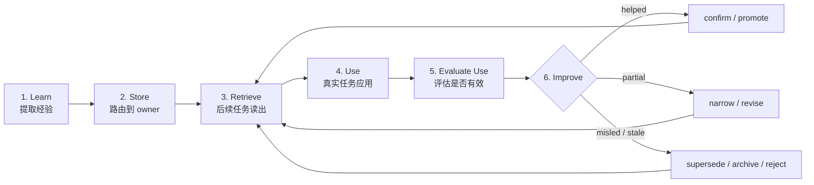

# 通用能力演化系统执行演练

Date: 2026-05-28
Status: execution drill note

## 结论

这套系统可以落地，但它不应该只叫学习系统。它必须变成 AI 每次任务都能执行、也能被 Skill、Agent 和项目复用的能力演化契约：先从经验中学习，再沉淀到正确 owner，再在后续任务中使用，再评估使用效果，最后确认、修正、归档或提升。

最重要的修正是：用户不需要判断内部映射是否正确。用户只需要判断最终使用效果、风险和是否接受长期规则。AI 必须负责内部执行、证据收集、使用效果评估、存储路由和升级候选。

## 演练目标

本轮演练检查一个问题：如果把 `Learning = 演化中的提取环节`、`Memory = 状态 / 证据层`、`Capability Evolution = 学习、使用、评估、改进的闭环` 作为设计，AI 是否能稳定做到以下几件事。

| 能力 | 检查点 |
| --- | --- |
| 准确执行 | 不误解任务，不跳过必要上下文，不越权行动 |
| 准确评估 | 不只看最终输出，还检查 trace、memory、policy、eval |
| 准确学习 | 只保存有未来作用的经验，避免过度泛化 |
| 准确使用 | 在后续任务中应用已学内容，并记录是否有效 |
| 准确改进 | 根据使用结果 confirm / narrow / revise / supersede / archive / reject / promote |
| 准确路由 | 区分学到的是 Agent 方法、业务知识、项目知识、流程经验还是 Skill 改进 |
| 完成任务 | 交付能让用户直接验收，而不是回到过程推理 |

## 最小执行契约

每次任务都按这个顺序跑。复杂任务完整执行，简单任务可以压缩，但不能跳过风险和证据判断。



## 多轮演练摘要

| 轮次 | 场景 | 初始风险 | 演练结论 | 必要修正 |
| --- | --- | --- | --- | --- |
| 1 | 普通研究任务 | 只产出文章 | 可通过 | 交付要含验收点 |
| 2 | 用户说“记住这个” | 过度保存 | 需修正 | 必须问未来用途和作用域 |
| 3 | 一次成功想变 Skill | 错误提升 | 需修正 | 单次成功只能进 `watch` |
| 4 | 旧记忆与当前事实冲突 | 旧知识污染 | 需修正 | 先验证 freshness，再 supersede |
| 5 | 输出正确但 trace 违规 | 假阳性通过 | 需修正 | policy / trace 一票否决 |
| 6 | 主观业务质量 | AI 自评分失真 | 可通过 | 人只评最终效果和偏好 |
| 7 | 工具失败后恢复 | 重复失败 | 需修正 | classify、换路、保留失败证据 |
| 8 | 私有信息进入记忆 | 公开边界风险 | 必须阻断 | 默认脱敏或不保存 |
| 9 | Skill / Agent / 项目复用同一学习能力 | 内容混放 | 需修正 | 机制集中，内容按 owner 存储 |
| 10 | Capability Evolution Skill 自我进化 | 自我批准 | 必须阻断 | 可自引用，不可自批准共享提升 |
| 11 | 学到内容没有被使用 | 沉淀变噪音 | 需修正 | 增加 use record 和 use_result |

## 演练 1：普通研究任务

### 场景

用户要求研究“人类学习过程如何映射到 AI 学习系统”，并希望沉淀成文档。

### AI 应执行

| 步骤 | 正确动作 |
| --- | --- |
| Intake | 识别为研究和设计任务，不是代码任务 |
| Retrieve | 读取项目说明、现有 docs、相关 memory |
| Execute | 写 research note，区分人类学习、memory、Skill、Agent、eval |
| Evaluate | 检查来源、结构、公开边界、是否有结论 |
| Learn | 若产生稳定设计问题，留在后续路线图 |

### 发现

这个场景可以顺利执行。主要风险不是写不出来，而是交付太像文章，缺少“用户如何验收”的入口。

### 修正

研究类交付必须明确三项：

1. 结论是什么。
2. 用户应该检查哪几段。
3. 哪些问题还只是候选设计，不能当成已落地规则。

## 演练 2：用户说“记住这个”

### 场景

用户在一次任务中说：“以后遇到某种情况都要这样做。”

### 初始失败模式

AI 可能直接把这句话写成全局规则。这样会把单次上下文、个人偏好或业务局部经验误提升到共享 memory。

### AI 应执行

| 判断 | 正确动作 |
| --- | --- |
| 是否明确未来任务 | 不明确时先归为 `watch` |
| 是否只属于当前项目 | 是则写项目层，不写全局层 |
| 是否含私有上下文 | 含则脱敏或不保存 |
| 是否改变协作规则 | 需要用户确认作用域 |
| 是否可被评估 | 没有评估方式则不能提升 |

### 修正

`remember` 不是写入许可本身。AI 必须把它解析成四个字段：

```yaml
content: 要记住的内容
evolution_target: agent_method | agent_business | software_project | workflow_process | skill_improvement | user_preference | runtime_behavior
storage_sink: current_project | owning_agent_repo | owning_skill_package | shared_skill_candidate | user_memory | runtime_candidate
scope: project | user | shared_candidate | runtime
future_use: 未来在哪类任务使用
evidence: 用户明确偏好 | 重复失败 | eval 发现 | 单次观察
```

如果 `future_use` 为空，记忆只能进入 `watch` 或不写入。

## 演练 3：一次成功想变 Skill

### 场景

某次任务中，一个处理方法效果很好。AI 判断“这可以变成 Skill”。

### 初始失败模式

AI 容易把“这次有效”误当成“以后都该这样”。这会让 Skill 变成经验堆积，而不是稳定能力。

### AI 应执行

| 证据 | 状态 |
| --- | --- |
| 一次低风险成功 | `watch` |
| 一次严重安全 / 信任失败 | `promote` candidate |
| 三次相似失败或重复修复 | `promote` candidate |
| eval 捕获真实回归 | strong `promote` candidate |
| 用户明确长期偏好 | promote 到正确层 |

### 修正

Skill promotion 必须有证据包，不能由 AI 单方面完成。

```text
Recommendation: 建议提升什么
Evidence: 哪些任务、反馈、失败或 eval 支持
Impact: 未来哪类任务会变好
Risk if changed: 可能增加什么负担
Risk if not changed: 哪类失败会重复
Target: 项目规则 / Skill / eval 模板 / runtime
Decision needed: accept / revise / defer / reject
```

## 演练 4：旧记忆与当前事实冲突

### 场景

Memory 里说某个库、工具或项目规则是 A。当前仓库或外部文档显示它已经变成 B。

### 初始失败模式

AI 可能继续相信旧 memory，导致方案过时。另一种失败是直接删除旧 memory，丢失历史原因。

### AI 应执行

| 步骤 | 正确动作 |
| --- | --- |
| Freshness check | 判断事实是否可能过期 |
| Verify | 用当前仓库、官方文档或实际命令验证 |
| Compare | 标明 A 与 B 的差异 |
| Decide | update / supersede / archive / keep |
| Report | 在交付里说明用了新事实 |

### 修正

Memory item 必须有 `last_confirmed` 或等价字段。对容易变化的事实，AI 不能只靠 memory 回答。

## 演练 5：输出正确但 trace 违规

### 场景

AI 最终答案看起来正确，但过程中跳过了审批 gate，或没有验证来源。

### 初始失败模式

如果只看最终输出，系统会误判为通过。下一次任务可能复用这条坏路径。

### AI 应执行

| 评估层 | 是否可替代 |
| --- | --- |
| Output | 不能替代 trace |
| Trace | 不能替代 outcome |
| Policy | 一票否决 |
| Memory | 检查读写是否合理 |
| Eval | 检查是否覆盖变体 |

### 修正

学习 eval 必须包含 trace invariant。典型 invariant：

- 高风险外部动作必须出现 approval gate。
- 写入长期 memory 前必须有 `evolution_target`、`storage_sink` 和 `scope`。
- 引用会变化的事实前必须验证 freshness。
- 工具失败后不能重复同一路径超过阈值。
- 没有 evidence chain 的结论不能进入高置信报告。

## 演练 6：主观业务质量

### 场景

AI 生成候选、报告、建议或设计方案。AI 可以检查结构，但很难判断用户是否真的觉得有用。

### 初始失败模式

AI 用自己的 rubric 代替用户偏好，导致“评分很高但不好用”。

### AI 应执行

| AI 负责 | 人负责 |
| --- | --- |
| 检查结构完整性 | 判断是否有用 |
| 检查证据链 | 判断是否符合偏好 |
| 给出风险和备选 | 接受、拒绝、修改 |
| 记录反馈原因 | 确认长期偏好是否成立 |

### 修正

用户反馈不需要理解内部机制。反馈入口应尽量简单：

```text
结果是否可用：yes / no / partial
主要原因：方向错 / 证据弱 / 太啰嗦 / 不够具体 / 风险不可接受 / 其他
是否作为长期偏好：yes / no / only this project
```

## 演练 7：工具失败后恢复

### 场景

AI 调用搜索、测试、构建、浏览器或外部工具失败。

### 初始失败模式

AI 可能重复失败命令，或者掩盖失败继续给出结论。

### AI 应执行

| 失败类型 | 正确动作 |
| --- | --- |
| 临时失败 | 重试一次，记录原因 |
| 参数错误 | 修正参数再试 |
| 能力缺失 | 换工具或降级方案 |
| 权限 / 高风险 | 停下并升级 |
| 多次失败 | 保留证据，报告残余风险 |

### 修正

Recovery 不是“继续试”。它必须先分类，再决定 retry、degrade、escalate 或 stop。

## 演练 8：私有信息进入记忆

### 场景

任务中出现私人路径、客户数据、聊天原文、token、凭证或业务敏感细节。

### 初始失败模式

AI 把原文写进公开 docs 或长期 memory。

### AI 应执行

| 信息类型 | 动作 |
| --- | --- |
| 凭证 / token | 不保存，提示风险 |
| 私人聊天原文 | 不复制，改写为抽象经验 |
| 本地敏感路径 | 只在交付中必要引用，不进入公开研究 docs |
| 业务私有数据 | 保持项目内，不提升到共享层 |
| 可公开方法论 | 脱敏后可进入 docs |

### 修正

公开仓库中的学习文档只能保存抽象后的设计经验。不能保存原始对话、私有数据或不可公开的项目事实。

## 演练 9：Skill / Agent / 项目复用同一学习能力

### 场景

同一个 `$capability-evolution` 能力被四类对象调用：Capability Evolution Skill 自身、其他 Skill、业务 Agent、软件开发项目。

### 初始失败模式

AI 把所有学到的东西都写进同一个“学习记忆”里，导致 Agent 业务知识、项目本地事实、通用方法和 Skill 改进互相污染。

### AI 应执行

| 调用方 | 学习内容 | 正确路由 |
| --- | --- | --- |
| Capability Evolution Skill | 自身规则、模板、checker | `skill_improvement` + `owning_skill_package` |
| 其他 Skill | 该 Skill 的流程或 eval | `skill_improvement` + `owning_skill_package` |
| Agent | 通用 Agent 方法 | `agent_method` + `owning_agent_repo` 或 `shared_skill_candidate` |
| Agent | 专有业务行为 | `agent_business` + `owning_agent_repo` |
| 项目 | 项目架构、命令、业务事实 | `software_project` + `current_project` |
| 项目 | 开发过程优化 | `workflow_process` + `current_project` |

### 修正

能力演化应该“机制集中，内容分属”。`$capability-evolution` 提供 loop、schema、use eval 和 promotion 规则；被学习的内容放在 owner 能维护的位置。

## 演练 10：Capability Evolution Skill 自我进化

### 场景

`$capability-evolution` 发现自己的模板、路由规则、use record 或 checker 无法覆盖新的复用场景，需要改进自己。

### 初始失败模式

AI 因为“这是我自己的学习能力”，直接把候选改动标成 active shared behavior。这样会绕过外部验收。

### AI 应执行

| 步骤 | 正确动作 |
| --- | --- |
| Classify | `evolution_target: skill_improvement` |
| Route | `storage_sink: owning_skill_package` 或 `shared_skill_candidate` |
| Draft | 起草 memory、eval、template 或 promotion package |
| Use | 在真实任务或示例中使用候选规则 |
| Verify | 运行 checker 或对应 eval，并记录 `use_result` |
| Approve | 共享层或高风险改动等人确认 |

### 修正

自引用是必须支持的，否则 capability-evolution Skill 无法自我进化。但自引用不等于自批准。它最多能起草、使用、验证和推荐，不能自己批准共享层提升。

## 演练 11：学习产物被使用后的再学习

### 场景

某条 memory、Skill rule、template 或 eval 在后续任务中被检索并用于指导输出。

### 初始失败模式

AI 只记录“我读到了这条 memory”，但没有判断它到底有没有帮助。这样系统会越积越多，却不知道哪些学习产物真的提高了能力。

### AI 应执行

| 步骤 | 正确动作 |
| --- | --- |
| Retrieve | 找到匹配的学习产物 |
| Use | 说明哪条 artifact 影响了本次任务 |
| Evaluate use | 记录 `helped / partial / misled / stale / not_applicable / not_used` |
| Improve | 转成 `confirm / narrow / revise / supersede / archive / reject / promote` |
| Learn again | 把 use result 当作新证据写回 |

### 修正

长期 artifact 必须有 use record。沉淀不是终点，使用效果才是证据。

## 演练后的执行契约

这套系统要让 AI 稳定执行，至少需要以下 6 个硬检查。

| 检查 | AI 必须问自己 | 失败时动作 |
| --- | --- | --- |
| Goal | 我是否知道用户要完成什么 | 不清楚且代价高则升级 |
| Target | 学到的是哪一类能力或知识 | 不清楚则不写长期记忆 |
| Sink | 谁拥有并维护这条学习产物 | 不清楚则默认项目 `watch` |
| Scope | 这是项目层、用户偏好、还是共享规则 | 不清楚则不提升 |
| Evidence | 我有什么证据支持这条学习 | 证据弱则 `watch` |
| Use | 这条学习产物是否真的被使用并产生效果 | 无使用证据则不能强 promotion |
| Trace | 我是否按正确路径执行 | trace 违规则不能判通过 |
| Evaluation | outcome、trace、memory、use_result、policy 是否都过 | 任一关键层失败则修正 |
| Lifecycle | 这条经验应 keep、watch、promote、archive、reject、supersede | 无未来用途则不保存 |

## Memory Item 最小字段

```yaml
id: memory_YYYYMMDD_short_slug
evolution_target: agent_method | agent_business | software_project | workflow_process | skill_improvement | user_preference | runtime_behavior
storage_sink: current_project | owning_agent_repo | owning_skill_package | shared_skill_candidate | user_memory | runtime_candidate
scope: project | user | shared_candidate | runtime
status: active | watch | promote | archive | rejected | superseded
source: user_feedback | task_trace | eval_result | repeated_failure | external_reference
context: 这条记忆来自什么任务
content: 要复用的结论
future_use: 未来在哪类任务使用
use_history:
  - applied_artifact: 哪条产物被使用
    task_context: 在什么任务中使用
    use_result: helped | partial | misled | stale | not_applicable | not_used
    evidence: 什么证明这个使用结果
    follow_up: confirm | narrow | revise | supersede | archive | reject | promote | none
last_use_result: helped | partial | misled | stale | not_applicable | not_used
evidence: 支持它的证据
counterexamples: 不适用的场景
risk: 错用会造成什么问题
last_confirmed: YYYY-MM-DD
review_trigger: time_based | conflicting_evidence | failed_reuse | user_feedback
```

字段不一定每次都完整写入，但 AI 在决定长期保存或提升前必须能回答这些问题。

## Eval Case 最小字段

```yaml
id: eval_YYYYMMDD_short_slug
goal: 要验证的能力
input: 初始任务或场景
expected_outcome: 最终应产出什么
expected_use:
  applied_artifact: 预期会影响任务的记忆 / 规则 / 模板 / Skill 行为
  use_result: helped | partial | misled | stale | not_applicable | not_used
expected_trace:
  must_do:
    - 必须验证来源
    - 必须读取相关 memory
  must_not_do:
    - 不得跳过 approval gate
    - 不得把单次经验提升为 Skill
scorers:
  - outcome_completion
  - use_result
  - trace_invariant
  - memory_scope
  - policy_gate
  - evidence_quality
human_review:
  required_for:
    - taste
    - business_value
    - shared_promotion
```

## Skill Promotion 最小生命周期

| 状态 | 含义 | 谁能推进 |
| --- | --- | --- |
| `watch` | 候选经验，证据不足 | AI 可记录 |
| `candidate` | 有证据，准备提升 | AI 可起草 |
| `approved` | 人确认值得提升 | 人决定 |
| `implemented` | 已写入 Skill / 规则 / 模板 | AI 可执行 |
| `validated` | 后续任务或 eval 证明有效 | AI 记录，人可验收 |
| `superseded` | 被新规则替代 | AI 可建议，人确认高影响替换 |
| `archived` | 不再活跃使用 | AI 可建议 |

## 人类参与边界

用户不需要参与内部细节判断。用户只需要在四类点上参与。

| 人类判断点 | 为什么需要人 |
| --- | --- |
| 最终结果是否有用 | 这是使用效果，不是内部指标 |
| 偏好是否长期成立 | AI 无法替用户决定品味 |
| 高风险动作是否批准 | 外部影响和责任边界需要人确认 |
| 经验是否提升到共享层 | 跨项目规则会影响未来任务 |

其他工作应由 AI 自主完成：读取记忆、分类证据、执行任务、跑 eval、发现矛盾、准备 promotion 包。

## 本轮发现的问题

| 问题 | 影响 | 修正 |
| --- | --- | --- |
| 旧版后续问题还像开放问题 | AI 不知道下一步怎么执行 | 已改成待设计决策 |
| Memory schema 未显式化 | 容易保存自由散文 | 加最小字段 |
| Eval 只写结果层不够 | 容易假阳性通过 | 加 trace invariant |
| Skill promotion 边界不够硬 | 单次成功可能变规则 | 加 lifecycle 和审批包 |
| 人类评估入口不够简单 | 用户被迫理解内部机制 | 只让用户评最终效果和长期偏好 |

## 落地状态

本轮演练已被落成 `skills/capability-evolution/` Skill 包。它包含 `Use / Memory / Eval / Skill Promotion / Storage Routing / Self-Evolution` 的最小执行规范，并回答六件事：

1. AI 在任务中如何判断是否写 memory。
2. AI 如何把失败或反馈转成 eval case。
3. AI 如何准备 Skill promotion 包，并等待人确认。
4. AI 如何把不同层级的学习内容路由到正确 owner。
5. Capability Evolution Skill 如何自引用但不自批准。
6. 学习产物如何被使用、评估，并反向驱动改进。

配套模板位于 `skills/capability-evolution/assets/templates/`。结构检查脚本位于 `skills/capability-evolution/scripts/check_evolution_package.py`。
