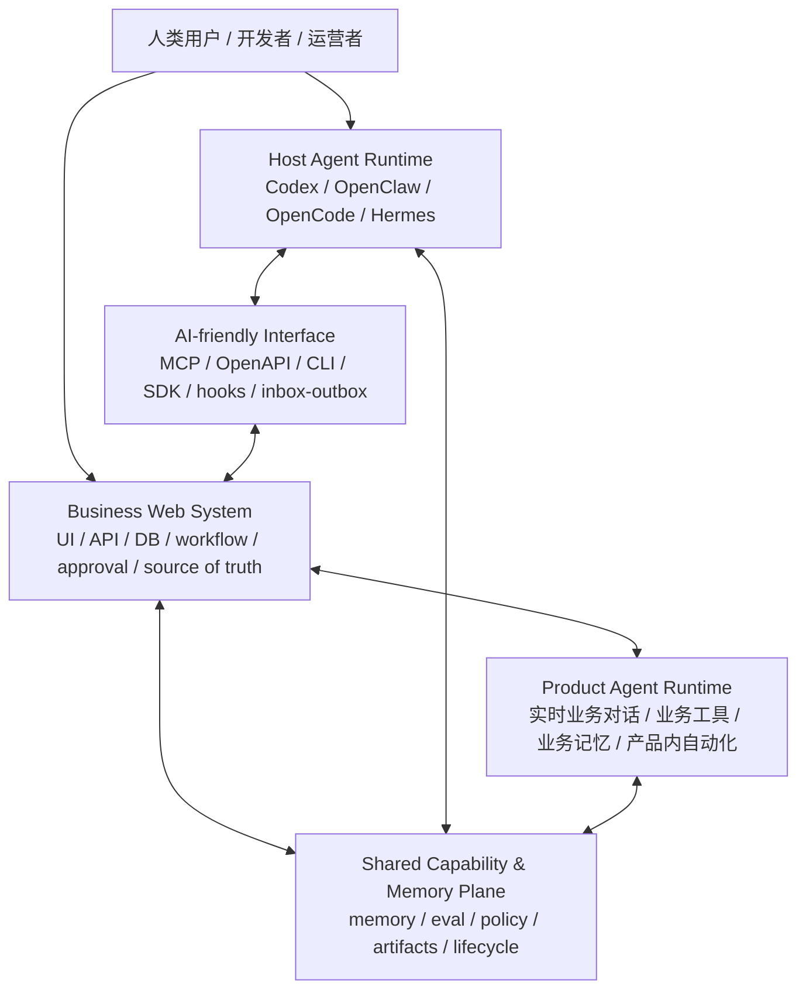
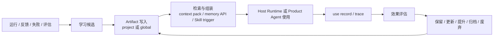

# 可演化业务系统与双 Agent Runtime 架构

状态：工作版架构笔记，供后续 Agent review；不是最终 `docs/` 结论。

结论：面向个人或小团队的可演化 AI 业务系统，不应该把 Codex 这类 Host Agent Runtime 当成业务系统能跑通的必要后端；更合理的结构是让业务系统自己拥有核心业务闭环和产品内 Agent Runtime，同时把 Codex 作为开发、运维、异步分析和能力演化的增强型协作者。长期学习资产应沉淀在可检索、可注入、可追踪、可评估、可下线的 capability / memory / eval artifact 中，而不是散落在某个 Runtime 的黑盒记忆里。

## 1. 背景和目标

本笔记整理 `capability-evolution` 设计讨论中的一个阶段性架构判断。

最初的问题是：如果一个 Skill 具有学习和演化能力，那么它最终服务谁？学习产物放在哪里？后续由谁使用和评估？继续讨论后，范围从“Skill 自身如何学习”扩展成“一个业务系统如何在第三方 Agent Runtime、产品内 Agent、文件化记忆、评估和能力包之间形成可演化闭环”。

当前目标不是定义完整平台，而是先形成一个可 review 的架构模型：

| 问题 | 当前回答 |
|---|---|
| 是否自研完整通用 Agent Runtime | 默认不自研 |
| 是否完全依赖 Codex / OpenClaw 等 Host Runtime | 不依赖 |
| 业务系统能否独立运行核心业务 | 必须可以 |
| 产品内是否可以有自己的 Agent Runtime | 可以，而且通常需要 |
| Codex 的定位 | 开发、运维、异步协作、能力演化增强 |
| 长期学习资产放哪里 | 项目或全局的可控 artifact 层 |
| 能力是否只等于 Skill | 不是，Skill 只是 procedural capability 的强载体 |

## 2. 核心术语

| 术语 | 含义 |
|---|---|
| `Host Agent Runtime` | Codex、OpenClaw、OpenCode、Hermes 等外部通用 Agent 执行环境 |
| `Business Web System` | 我们自己的业务系统，包含 UI、API、DB、workflow、权限、状态和业务事实 |
| `Product Agent Runtime` | 嵌入业务系统内、面向终端用户或业务流程的 Agent Runtime |
| `Capability Package` | 可迁移能力资产集合，例如 Skill、AGENTS.md、prompt、policy、memory、eval、tool contract |
| `Shared Capability & Memory Plane` | 两类 Runtime 和业务系统共同使用的能力、记忆、评估、生命周期资产层 |
| `Runtime Bridge` | Host Runtime 与业务系统之间的接口，例如 MCP、API、CLI、SDK、hooks、文件或 DB inbox/outbox |

这里最重要的区分是：`Host Agent Runtime` 和 `Product Agent Runtime` 是两个不同平面。

| 对比 | Host Agent Runtime | Product Agent Runtime |
|---|---|---|
| 典型例子 | Codex | 页面内业务 AI 对话 |
| 使用者 | 开发者、运营者、系统维护者 | 终端用户、业务人员、自动流程 |
| 交互特点 | 异步、长任务、工程能力强 | 实时、产品化、业务约束强 |
| 控制程度 | 低到中，取决于宿主能力 | 高，由业务系统拥有 |
| 模型/API | 由宿主决定或配置 | 业务系统可自选，例如 DeepSeek、OpenAI、本地模型 |
| 主要责任 | 构建、修改、排查、批量处理、生成 artifact | 实时对话、业务工具调用、产品内自动化 |

## 3. 推荐架构



这个结构的核心判断是：

1. `Business Web System` 是业务事实和核心流程的源头。
2. `Product Agent Runtime` 服务产品内实时或半实时业务体验。
3. `Host Agent Runtime` 可以开发系统、修改系统、读取系统数据、提交建议、处理低实时性任务，但不是核心业务闭环的必需后端。
4. `Shared Capability & Memory Plane` 保存长期学习产物，避免把业务能力锁进某个 Runtime 的私有上下文。
5. `Runtime Bridge` 让系统对 AI 友好，但桥接失败不应导致核心业务无法运行。

## 4. Codex 的合理定位

Codex 这类工具的作用可以比“写代码”更宽，但它仍然应该是增强层。

| 使用路径 | 是否核心依赖 | 说明 |
|---|---:|---|
| 编写和修改业务系统 | 是开发期核心能力 | 但运行期系统不能依赖它才能服务用户 |
| 排查问题、生成报告、批量整理数据 | 可选增强 | 适合低实时性任务 |
| 通过 API / DB / 文件与系统交换数据 | 可选增强 | 可以操作部分系统状态，但应可审计 |
| 生成 eval、总结失败、更新 Skill 候选 | 可选增强 | 很适合能力演化 |
| 作为终端用户实时对话后端 | 不建议 | 实时性、产品控制、权限和成本边界不稳定 |
| 作为业务系统唯一状态源 | 不允许 | 会导致不可复现、不可审计、不可迁移 |

推荐把任务分成三档：

| 档位 | 例子 | 设计要求 |
|---|---|---|
| Core Path | 用户对话、核心业务流程、状态变更 | 不依赖 Codex |
| Assist Path | 运营分析、异常排查、批量生成报告 | 可用 Codex，但要有结构化接口 |
| Evolution Path | 失败总结、eval 生成、Skill 改进、架构复盘 | Codex 很适合，但产物要回写 artifact 层 |

一句话原则：

```text
Codex 可以让系统更聪明、更好维护、更快演化，但不能是系统活着的条件。
```

## 5. AI-friendly 系统接口

业务系统既要 human-friendly，也要 AI-friendly。

| 面向人 | 面向 AI |
|---|---|
| 页面、表单、按钮、审批流 | MCP tools、OpenAPI、CLI、JSON schema |
| 报告和状态页 | `/ai/context`、`/ai/tasks`、`/ai/artifacts` |
| 人工反馈 | `feedback_event`、`eval_result`、`lifecycle_decision` |
| 实时对话 UI | product agent API、memory API、tool policy |

Codex 与系统交流，不只能靠文档或文件。根据当前 Codex CLI 和官方文档，可考虑这些接口：

| 接口 | 方向 | 适用场景 | 备注 |
|---|---|---|---|
| CLI / JSON 命令 | Host -> System | 稳定项目操作、报告、批处理 | 最容易落地 |
| HTTP API / OpenAPI | Host -> System | 查询、提交任务、更新状态 | 需要权限和审计 |
| MCP Server | Host -> System tools | 暴露 AI 可调用工具面 | 适合作为 AI-friendly 接口 |
| Codex SDK | System -> Codex | 程序化启动或继续 Codex 任务 | 适合更深集成 |
| Codex App Server | System <-> Codex | 线程、事件、审批、动态工具 | 更强但更复杂 |
| Codex MCP Server | Other Agent -> Codex | 把 Codex 当工程 Agent 工具 | 适合多 Agent 协作 |
| Codex Hooks | Codex -> System | 日志、记忆候选、策略检查、turn stop eval | 适合被动连接 |
| Apps / Connectors / Plugins | Host -> External service | 打包工具和工作流 | 取决于宿主生态 |
| Browser / Computer Use | Host -> UI | 临时操作已有页面 | 比 API/MCP 脆弱 |

接口设计的优先级应该是：

```text
API / MCP / CLI / structured data
  > file / DB inbox-outbox
  > browser UI operation
  > raw chat instruction
```

如果只能用文件或数据库通信，也应有明确 schema、run id、status、lock、idempotency、provenance 和 validation。

## 6. Capability Package 分层

由于存在两个 Runtime 平面，capability 不能只按“一个 Skill 包”理解。它应该按运行位置和使用方式分层。

| 层 | 运行位置 | 典型内容 |
|---|---|---|
| Host-only capability | Codex / Host Runtime | `AGENTS.md`、Codex Skill、hooks、Codex MCP config、项目操作手册 |
| Product-agent-only capability | Product Agent Runtime | prompt registry、业务工具、对话策略、用户会话 memory |
| Shared capability | 两边共用 | 业务 schema、memory item、eval case、tool contract、policy、artifact spec |
| Bridge capability | 接口层 | task queue、run record、inbox/outbox、adapter、trace schema |
| Governance capability | 业务系统或共享层 | lifecycle decision、promotion rule、forgetting rule、approval policy |

建议用统一 artifact 结构表达能力归属：

```yaml
capability_artifact:
  id: cap_xxx
  type: skill | memory | prompt | policy | tool | eval | bridge | lifecycle
  owner: project | global | business_system | agent_package
  runtime_scope: host_only | product_agent_only | shared | bridge
  entrypoints:
    host_runtime:
      - AGENTS.md
      - Skill
      - hook
      - MCP
    product_agent_runtime:
      - prompt_registry
      - memory_api
      - tool_policy
      - eval_hook
  evidence:
    use_records: []
    eval_results: []
  lifecycle: active | watch | archive | superseded | rejected
```

这个 schema 的重点不是字段一次定死，而是要求每个学习产物回答三个问题：

1. 谁拥有它？
2. 哪个 Runtime 会用它？
3. 它是否真的被使用并改善了结果？

## 7. 学习产物和记忆归属

Agent 的“学习”最终不是抽象能力，而是一组可管理产物。最小落地形态是：

```text
文件化/数据库化记忆
  + Skill / AGENTS 入口
  + runtime hooks / bridge
  + eval / forget 生命周期
```

学习产物可以分为：

| 产物类型 | 例子 | 使用方式 |
|---|---|---|
| Semantic memory | 用户偏好、业务事实、项目 profile | 检索后注入 context 或提供 API |
| Episodic memory | 成功/失败轨迹、few-shot 示例、use history | 作为案例或回归样本 |
| Procedural memory | `AGENTS.md`、`SKILL.md`、prompt rule、policy | 直接约束行为 |
| Eval memory | cases、rubrics、baselines、reports | 判断是否真的变强 |
| Evolution record | `status`、`last_used_at`、`supersedes` | 管理更新和遗忘 |
| Runtime/config/code | tool policy、router、adapter、scorer | 对关键规则做硬约束 |

在双 Runtime 架构下，memory item 需要带使用范围：

```yaml
memory_item:
  id: mem_xxx
  owner: business_system
  scope: shared | host_runtime | product_agent_runtime
  readable_by:
    - codex
    - product_agent
    - web_system
  writable_by:
    - web_system
  used_by:
    - runtime: codex
      entrypoint: skill
    - runtime: product_agent
      entrypoint: memory_api
  evidence:
    use_records: []
    eval_results: []
  lifecycle: active
```

默认原则：

1. 业务记忆不应只存在 Host Runtime 的隐藏记忆里。
2. 产品内实时对话记忆可以在业务系统 DB 中管理。
3. Codex 产生的记忆候选应写成 artifact，再由系统或人审批吸收。
4. Shared memory 要有 scope、owner、读写权限和生命周期。
5. 记忆的价值由后续使用和效果评估证明，不由“写入成功”证明。

## 8. 使用和评估闭环



评估应该从使用体验出发，而不是绑定某个实现方案。

| 层 | 关键问题 | 指标 |
|---|---|---|
| Retrieval | 该取出的有没有取出 | recall、漏召回、误召回 |
| Utilization | 取出后有没有被用 | trace 引用、工具参数、决策引用 |
| Outcome | 用了以后是否更好 | pass rate、返工率、人工采纳率 |
| Cost | 值不值得保留 | token、延迟、干扰、维护成本 |
| Freshness | 还对不对 | 过期、冲突、被新规则替代 |

记忆系统的体验成熟度可以这样看：

| 等级 | 用户可见体验 |
|---|---|
| L0 | 没有连续性，每次都从零开始 |
| L1 | 当前会话能保持上下文 |
| L2 | 能记住明确告诉它的事实 |
| L3 | 能在合适时机主动使用记忆 |
| L4 | 用户能纠正、更新、删除记忆 |
| L5 | 能基于效果证据自我改进和治理 |

遗忘不应默认删除，而应走状态迁移：

| 状态 | 含义 |
|---|---|
| `active` | 当前有用，继续召回 |
| `watch` | 可能有用，但证据不足 |
| `archive` | 暂停使用，保留历史 |
| `superseded` | 被新知识替代 |
| `rejected` | 错误或有害，不再使用 |

## 9. 与自研完整 Runtime 的关系

当前不建议个人或小团队自研完整通用 Agent Runtime。原因是完整 Runtime 涉及模型适配、tool calling、planner、context、memory、policy、trace、eval、UX、沙箱、插件、升级和安全维护。

但这不等于什么 Runtime 代码都不写。

| 层 | 当前决策 | 说明 |
|---|---|---|
| 通用 Host Agent Runtime | 不自研 | 使用成熟第三方 Runtime |
| 产品内 Agent Runtime | 可以自研或框架化 | 只服务业务系统，不做通用平台 |
| model provider adapter | 可以自研薄层 | DeepSeek、OpenAI、本地模型等 |
| tool runtime | 可以自研薄层 | 业务工具注册、校验、权限 |
| memory API | 可以自研 | 属于业务系统状态管理 |
| eval runner | 可以自研 | 评估业务能力和记忆效果 |
| Runtime Bridge | 可以自研 | API、MCP、CLI、hooks、inbox/outbox |

更准确的技术路线是：

```text
不要自研通用 Host Agent Runtime。
要自控业务系统、产品内 Agent Runtime、共享能力资产和评估闭环。
Codex 作为增强型协作者接入，而不是作为业务系统必需后端。
```

## 10. 给其他 Agent 的 review 问题

建议后续 review 不只问“架构是否正确”，而是从这些角度检查：

| 视角 | Review 问题 |
|---|---|
| 使用者 | 核心业务是否能在没有 Codex 时完成？AI 体验是否稳定、可纠正、可解释？ |
| 构建者 | 是否避免自研通用 Runtime？是否把复杂度压在业务必要层？ |
| 产品内 Agent | 实时对话、工具权限、记忆使用和失败恢复是否有明确边界？ |
| Codex / Host Agent | 它的增强任务是否有结构化接口？是否会越权成为隐形后端？ |
| 能力资产 | capability 是否按 runtime_scope 分层？是否有 owner 和 entrypoint？ |
| 记忆治理 | memory 是否可检索、可更新、可停用、可审计？ |
| 评估 | 是否评估 retrieval、utilization、outcome、cost、freshness？ |
| 安全 | 权限、审批、外部动作、隐私和公开仓库边界是否清楚？ |
| 可迁移性 | 换 Host Runtime 后，业务系统和学习资产是否仍然可用？ |
| 运维 | trace、run record、失败重试、幂等和数据修复是否可做？ |

## 11. 初步自评

### 11.1 使用者视角

优点：这个架构把核心体验放在业务系统和产品内 Agent Runtime 中，不要求终端用户等待 Codex 这类开发侧 Agent 参与。实时对话、业务状态和用户反馈可以产品化。

风险：如果 Shared Capability & Memory Plane 设计得太重，用户会感到系统“懂很多但反应慢”。第一版应只放少量高价值记忆和规则。

需要补充：定义用户如何查看、纠正、关闭某条记忆或能力。

### 11.2 构建者视角

优点：避免从零写完整通用 Runtime，同时保留业务侧可控性。Codex 能继续作为高效开发者和异步协作者。

风险：系统边界变多，容易把 Bridge、Product Agent Runtime、Capability Package 同时做大。第一版必须从一个业务闭环和一两个 AI-friendly 接口开始。

需要补充：最小落地顺序，例如先做 `task_request`、`agent_run`、`artifact`、`feedback_event` 四个对象。

### 11.3 Product Agent Runtime 视角

优点：产品内 Agent 可以选更合适的模型、API、延迟和成本结构，不被 Codex 的运行方式绑定。

风险：如果产品内 Agent 也开始追求通用 planner、长期自治、多工具复杂调度，就会重新走向自研 Runtime 平台。

需要补充：限定第一版 Product Agent Runtime 的能力范围，例如只做业务问答、结构化抽取、候选评分或工作流建议。

### 11.4 Codex / Host Agent 视角

优点：Codex 的强项被放在合适位置：代码、项目理解、文件操作、复杂推理、异步任务、能力沉淀。

风险：如果给 Codex 太多写权限和系统 API，它可能变成难以审计的运营后端。

需要补充：Codex Bridge 的权限等级、审批点、dry-run、变更审计和回滚机制。

### 11.5 Capability Evolution 视角

优点：学习产物不再只落到 Skill，而是能落到 memory、eval、policy、tool、bridge、prompt 和 lifecycle record。

风险：artifact 类型过多会导致治理成本上升。需要先定义最小 schema，再逐步扩展。

需要补充：`capability_artifact`、`memory_item`、`use_record`、`eval_result`、`lifecycle_decision` 的字段草案。

### 11.6 安全和治理视角

优点：把业务事实源头放回 Web 系统，有利于权限、审计、审批和数据清理。

风险：AI-friendly 接口如果没有权限分层，会成为新的风险入口。

需要补充：接口级 risk class，例如 read-only、suggest、write-draft、write-approved、external-effect、destructive。

## 12. 当前建议

下一步不应先做“大 memory 平台”或“通用 Agent Runtime”。建议先做一个最小设计包：

| 对象 | 用途 |
|---|---|
| `task_request` | Host Runtime 或系统提交任务 |
| `agent_run` | 记录一次 Codex 或 Product Agent 执行 |
| `artifact` | 保存产物、建议、报告、memory 候选 |
| `memory_item` | 保存可复用记忆 |
| `use_record` | 记录某条能力或记忆是否被用到 |
| `eval_result` | 记录效果 |
| `lifecycle_decision` | 保留、更新、归档、废弃 |

第一版可以只验证一个闭环：

```text
业务系统产生任务
  -> Codex 或 Product Agent 处理
  -> 写回 artifact
  -> 人或 eval 评估
  -> 生成 memory/capability 候选
  -> 下一次任务中被检索和使用
  -> 记录 use_record
```

如果这个闭环跑通，再考虑提升到 `docs/`，并把 schema 固化到 `skills/capability-evolution/` 或项目级模板中。

## 13. 参考来源

- OpenAI, [Codex CLI](https://developers.openai.com/codex/cli)
- OpenAI, [Codex SDK](https://developers.openai.com/codex/sdk)
- OpenAI, [Codex App Server](https://developers.openai.com/codex/app-server)
- OpenAI, [Codex Hooks](https://developers.openai.com/codex/hooks)
- OpenAI, [Codex with Agents SDK](https://developers.openai.com/codex/guides/agents-sdk)
- DeepSeek AI, [awesome-deepseek-agent](https://github.com/deepseek-ai/awesome-deepseek-agent)
- OpenCode, [OpenCode docs](https://opencode.ai/docs/)
- OpenClaw, [Capabilities overview](https://docs.openclaw.ai/tools)
